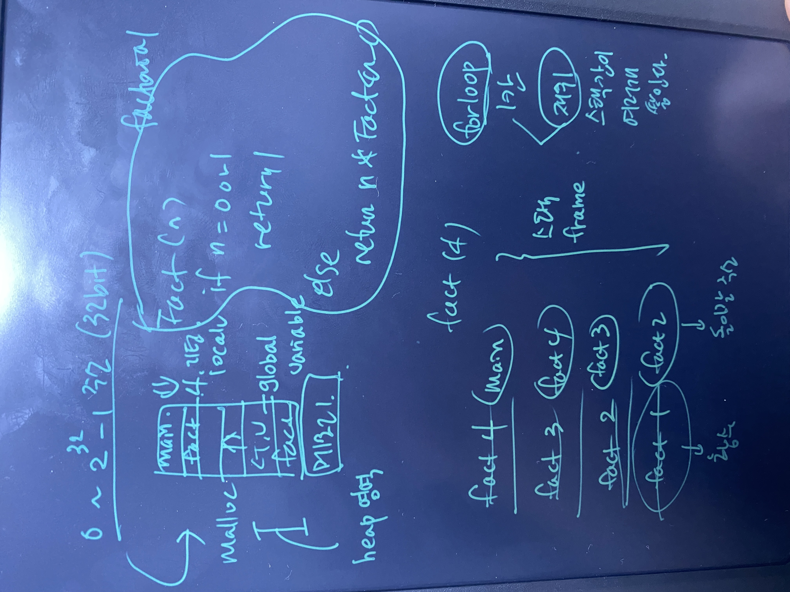

# STEPS

STEP1. 이산수학, 자료구조, 알고리즘

STEP2. 네트워크, 운영체제, 컴퓨터구조

STEP3. 오토마타, 형식언어, 컴파일러, 데이터베이스


# 이산수학

|BOOK| 컴퓨터 사고력을 키우는 이산수학

|VOD| 공학 >컴퓨터ㆍ통신 >컴퓨터공학 | [이산수학] 가톨릭대학교 황병연


### 개요(0422)

- 이산수학(Discrete Mathmatics) : 연속적인 개념을 사용하지 않고 이산적인 수학 구조에 대해 연구하는 학문으로, 이산적인 대상물들을 분석하여 응용의 기반으로 삼는 학문이다. 예를 들어 디지털 시계는 이산적, 아날로그 시계는 연속적인 개념이다.
- 수학적 모델링
  - 1. 주어진 문제의 상황과 배경을 이해
    2. 주어진 문제의 수학적 구조와의 매핑  - 어떤 자료구조를 쓸 것인가? + 수학적 개념
    3. 수학적 기초 개념을 이용한 문제 해결


### 논리와 명제(0422)

- 명제란? 객관적인 기준으로 진릿값(참 또는 거짓)을 구분할 수 있는 문장이나 수식.

- 논리 연산 6가지
  - 부정(NOT)
  - 논리곱(AND) : 둘 다 참이어야 참
  - 논리합(OR) : 둘 다 거짓이어야 거짓
  - 배타적 논리합(XOR) : 진릿값 둘 중 하나만 참일 때 참
  - 조건(p -> q) : 둘다 참이거나 가정이 F이면 참
  - 쌍방 조건 (p<->q) : p, q가 둘 다 참이거나 둘 다 거짓이면 참
- 역, 이 대우 : 조건명제와 대우의 진리값은 같다.
- 논리적 동치 : 두 개의 합성명제 P와 Q의 진릿값이 같은 경우
- 한정자
  - 전체한정자
    - 모든 원소에 대해 그 명제가 참이면 그 명제함수도 참이다.
    - 원소 중 하나라도 명제가 거짓이면 명제함수는 거짓이다.
  - 존재한정자
    - 원소들 중 하나라도 명제함수를 참으로 하는 원소가 있다면 명제함수도 참이다.
    - 모든 함수에 대해 그 명제가 거짓이면 그 명제함수는 거짓이다.
  - **부정
    - "이 상자에 있는 모든 과일은 사과이다." 부정 | "이 상자에 있는 어떤 과일은 사과가 아니다."
    - "이 상자에 있는 어떤 과일은 사과이다." 부정 | "이 상자에 있는 모든 과일은 사과가 아니다."
- 추론
  - 논리적 추론 : 참(T)인 명제를 근거로 하여 다른 명제가 참(T)임을 유도하는 방식


### 그래프(0421)

- 개념 
  - 그래프 G는 꼭짓점 집합 V와 변 집합 E로 구성된다.
  - 형태 : 다중그래프, 방향그래프, 가중치그래프
  - 차수 : 꼭지점 v에 근접하는 변의 수
- 종류
  - 부분그래프와 부분 신장 그래프(Spanning Graph) : 부분 신장 그래프는 그래프 G의 꼭짓점을 모두 포함하지만 변은 일부만 포함하는 그래프입니다.
  - 동형 그래프
  - 평명 그래프(Planar Graph) 와 오일러 공식
  - 연결 그래프 : 그래프를 구성하는 모든 꼭짓점 사이에 경로가 존재하는 그래프입니다.
  - 이분 그래프(Bipartite Graph) 
- 표현
  - 인접행렬
  - 인접리스트 : 그래프 G=(V, E)를 구성하는 각 꼭짓점에 인접하는 꼭짓점들을 연결리스트로 표현한 것입니다.
- 오일러와 해밀턴
  - 오일러 경로와 오일러 그래프 : 그래프의 모든 변을 한 번씩만 지나는 경로입니다.
  - 해밀턴 경로와 해밀턴 그래프 : 그래프의 모든 꼭짓점을 한 번씩만 지나는 경로입니다. 
- 그래프의 활용
  - 최단 경로 문제
    - 다익스트라 알고리즘 : 특정 노드에서 다른 노드들 까지의 각각의 최소 거리를 구하는 알고리즘입니다.
    - 순회판매원 문제(해밀턴 순회 응용): 방문해야 할 도시들과 이들 사이의 거리가 주어질 때, 판매원이 특정 도시에서 출발하여 어떠한 도시도 두 번 방문하지 않고 모든 도시를 거쳐 처음 출발한 도시로 돌아올 때, 총 여행 거리가 최소가 되는 경로 => 가장 가까운 거리의 도시를 고르는 그리디 알고리즘. 최소가 아닌 '최적'의 경로를 구하는 것입니다. (nearest-neighbor 최근점 이웃 방법)
  - 그래프 탐색
    - 깊이 우선 탐색
    - 너비 우선 탐색
- 그래프와 색칠 문제 : 4색 문제 - 평면을 유한 개의 부분으로 나누어 각 부분에 색을 칠할 때, 서로 맞닿은 부분을 다른 색으로 칠한다면 최대 4가지 색으로 충분합니다. 지도를 생각해봤을 때, 특정 국가를 둘러싼 나라가 짝수 개라면 3가지 색, 홀수 개면 4가지 색이 필요합니다.


# 자료구조

|BOOK| 파이썬으로 배우는 자료 구조 핵심 원리

|VOD| 공학 >컴퓨터ㆍ통신 >컴퓨터공학 | [자료구조] 건국대학교 남원홍


### 개요(0423)

- 데이터형 Data Types , 변수들이 가질 수 있는 값의 종류
  - primitive & user data type
- 데이터 구조 Data Structures
  - 선형 : 연결리스트, 스택, 큐
  - 비선형 : 트리, 그래프
- 추상 데이터형  Abstract Data Type
  - 문제를 푸는 과정을 단순화시키기 위해 데이터 구조와 연산을 합쳐 놓은 것
  - 구현 레벨을 생각하지 않고 상위 레벨에서만 생각하는 것
  - C++, Java (OOP) 학생 데이터 타입이라면 공부하기, 수강신청하기 등 행위까지 포함
  - 리스트, 스택, 큐, 우선순위 큐, 이진트리, 집합, 해시테이블, 그래프 등
- 왜 알고리즘을 분석하는가?
  - 한 가지 문제를 푸는 데 여러 가지 알고리즘이 있을 수 있다.
  - 알고리즘 분석은 시간과 공간적으로 어느 것이 가장 효율적인지 알 수 있게 해준다.
- 수행 시간 분석
  - 문제의 크기(입력의 크기 n)이 증가함에 따라 처리 시간이 얼마나 증가하는지를 분석한다.
  - 증가율 : 함수의 입력의 크기가 증가함에 따라 수행 시간이 증가하는 비율
- 분석의 종류
  - 알고리즘은 어떤 입력이냐에 따라 수행시간이 달라진다
  - 최선의 경우 vs. 최악의 경우 vs. 평균
  - Big-O notation


### 재귀와 백트래킹(0423)

- 자기 자신을 호출하는 함수를 recursion 이라 한다.
- 재귀적 알고리즘에는 두 가지 경우, 재귀적 경우(recursion case)와 기본 경우(base case)가 있다.
- ""더 작은 문제""를 풀게 하는 것이며 작은문제는 결국 수렴해야 한다.(base case)

- 재귀의 경우 메모리에 스택프레임 공간이 필요하다.
- 무한 재귀에 들어가면 메모리 용량을 초과해서 stack overflow를 초래한다. (힙영역, malloc 부분과 만나면 OS가 강제종료시킨다.)
- 무한 루프(while)은 추가적인 메모리가 필요한것은 아니므로 위의 문제를 초래하진 않는다.




### 연결리스트

- 리스트는? 순서가 있는 데이터의 집합
- Array vs. Linked List 각각의 장단점 파악
- 배열의 장점
  - 간단하고 사용하기 쉽다.
  - 항목에의 접근이 더 빠른다.
- 배열의 단점
  - 고정된 크기. 배열의 크기는 정적이다. 실행 시간에 변경 불가.
  - 특정 위치에 항목을 삽입하려면 다 밀어야 하므로 시간이 오래 걸린다.
- 동적 배열
  - 실행 시간에 Array의 사이즈를 늘리고 줄일 수 있는 배열이다.
  - 배열이 다 차면 원래 배열의 2배 크기의 새 배열을 만든다.
  - 배열의 항목 수가 절반 이하가 되면 배열 크기를 반으로 줄인다.
- 연결리스트의 장점
  - 메모리 공간을 낭비하지 않는다.
  - 상수 시간 안에 확장이 가능하다.
- 연결리스트의 단접
  - 개별 항목에 접근하는 시간이 길다. 배열이 O(1)이라면 연결리스트는 최악의 경우 O(n)
  - 
- 정적 vs 동적? 프로그램 실행전에 결정되면 static array, 실행시간에 변하면 dynamic array


### 그래프(0421)

- 개념

  - 방향 그래프 vs. 무방향 그래프

  - 방향이 있고 사이클이 없는 그래프 = 트리

- 표현

  - 인접리스트 : 정점 v에 연결된 모든 정점을 연결리스트로 표현.
    - 장점 : sparse한 그래프의 경우 인접행렬(V^2)보다 공간 낭비가 적다.
    - 단점 : 노드를 삭제하면 다른 노드의 연결리스트의 노드도 삭제해야 한다. 속도 측면에서 인접행렬보다 느리다.

- 최단경로 알고리즘

  - Unweighted graph 의 shortest path -> BFS
    - 수행시간 : 인접리스트 사용시 O(E + V) : for loop 에서는 주어진 정점으로 부터 나가는 간선을 검사하고  while loop 안에서 검사된 모든 간선의 합은 총 간선의 수와 같으므로 O(E)이다. 인접행렬을 사용했다면 복잡도는 O(V^2) 이다. 주어진 정점에 인접한 정점을 찾기 위해 길이가 V인 행렬의 한 행 전체를 읽어야 하기 때문이다.
  - Weighted grapth - Dijkstra algorithm -> BFS의 일반화
    - 현재 노드에서 가장 짧은 거리의 노드 찾는법 -> Priority Queue
    - 음수 간선을 처리할 수 없다.

- MST(Minimun Spanning Tree)

  - 사이클이 없는 연결된 그래프 + 무방향 그래프 + 가중치 그래프
  - 크루스칼 알고리즘

  ```
  V(정점) 의 서로 다른 트리로 시작한다. 모든 노드 다 돌거나 또는 edge가 V-1 개면 for loop 끊고 종료해도 된다.
  - MST를 만드는 동안 매번 최소 weight를 가진 edge를 선택해서(우선순위큐), 그 edge가 사이클을 만들지 않는다면 트리에 추가한다.
  - 처음에는 |V|개의 노드가 각각 트리로 존재한다.
  - 이때, edge를 하나 추가하면 두 개의 트리가 하나로 합쳐진다.
  - 알고리즘이 종료하면 오직 하나의 트리만 남는데, 이것이 MST 이다.
  ```

  크루스칼 알고리즘을 구현하는 두 가지 방법.

  1. Disjoint set의 UNION, FIND연산

     - 각 노드는 각각의 집합으로 시작해서
     - 매번 두 정점의 각각의 집합을 찾는다(FIND)  FIND(B) = FIND(C)?
     - 둘의 집합이 같으면 연결했을때 사이클이 생길테니까 Spanning Tree에 넣지않는다.
     - 둘의 집합이 다르면 Spanning 트리에 넣고 UNION으로 집합을 합친다.

     

  2. Priority Queue를 사용하여 weight를 priority queue 안에 유지

     - edge를 작은 순으로 쫙 넣는다.

  

  - 프림 알고리즘
    - 크루스칼과 다르게 시작점이 정해진다. 하나의 트리에서 시작해서 트리를 늘려나간다.
    - BSF처럼 가는데 다음에 갈 노드를 보고(큐에서 꺼낸 현재 노드), 그 노드로 가는 길들 중에 가장 weight이 작은 길을 선택한다.
    - 어디서 시작하던 같은 결과가 나온다.

  

# 알고리즘

|BOOK| 파이썬 알고리즘 인터뷰 

|VOD| 공학 >컴퓨터ㆍ통신 >컴퓨터공학 | [알고리즘] 건국대학교 김강일

